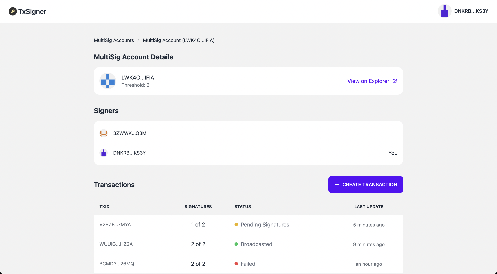

[](https://github.com/strandgeek/Algorand-MultiSig/actions/workflows/go.yml)

# Algorand Multi-Sig Signer

This repo, includes all of the code necessary to facilitate the signing of multi-signature transactions without exposing SK's.

## Quick Menu

- [📹 Video - App Demo](https://www.youtube.com/watch?v=IwDzK1tyyo0)
- [⚡️ Live Demo (Testnet)](https://txsigner.strandgeek.com/)
- [📄 Work Plan and User Stories (Notion)](https://kaput-water-8b9.notion.site/Algorand-MultiSig-Bounty-bad9053e69084f92a3e5713583fb8585)


### Contributors

- [Umar Farooq](https://github.com/UmarFarooq-MP)
- [Ronan Clooney](https://github.com/clooneyr)
- [Owan Hunte](https://github.com/owanhunte)

## UI Preview




## Design Flow


## Set-up guide

### Backend

#### Setup Dependencies

```bash
$ cd backend
$ go mod tidy
```

#### Configuration

##### Using YAML

Create a `config.yaml` file:

```yaml
server:
  host: 127.0.0.1
  port: 8082

algorand:
  address: https://testnet-algorand.api.purestake.io/ps2
  api_header: X-API-Key
  api_token: <YOUR_API_TOKEN>

auth:
  jwt_secret: my-jwt-secret

logger:
  level: "debug"
  encoding: "json"
  output_paths:
    - stdout
    - logs/out.json
  error_output_paths:
    - stdout
    - logs/out.json

```

##### Using Environment Variables

You can use environment variables to configure the service as well:

- SERVER_HOST
- SERVER_PORT
- ALGORAND_ADDRESS
- ALGORAND_API_HEADER
- ALGORAND_API_TOKEN
- AUTH_JWT_SECRET
- LOGGER_LEVEL
- LOGGER_ENCODING
- LOGGER_OUTPUT_PATHS
- LOGGER_ERROR_OUTPUT_PATHS


#### Running the service

```bash
$ go run cmd/main.go
```

After the above commands have been executed you will have the backend service running on localhost:8081

**Authorization**
- POST /ms-multisig/v1/auth/nonce
- POST /ms-multisig/v1/auth/complete
- GET /ms-multisig/v1/auth/me

**MultiSig Accounts**
- POST /ms-multisig/v1/auth/multisig-accounts
- GET /ms-multisig/v1/auth/multisig-accounts
- GET /ms-multisig/v1/auth/multisig-accounts/:msAddress
- GET /ms-multisig/multisig-accounts/:msAddress/transactions

**Transactions**
- POST /ms-multisig/v1/transactions
- GET /ms-multisig/v1/transactions/:txId

**Signed Transactions**
- POST /ms-multisig/v1/signed-transactions

### Frontend

```
cd frontend
```

```
npm i or npm install
```

Create a `.env` file with the contents:

```
REACT_APP_API_BASE_URL=http://localhost:8081/ms-multisig/v1
REACT_APP_EXPLORER_BASE_URL=https://testnet.algoexplorer.io
```

And start the server:
```
npm start
```

After the above commands have been executed you will have the frontend running on localhost:3000
